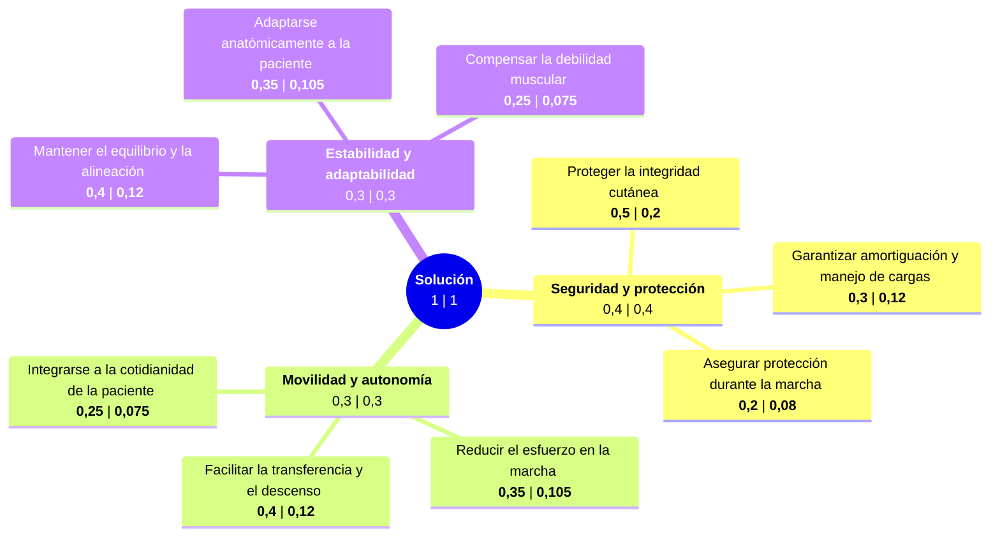

# Árbol de Objetivos Ponderados: 
## Jerarquización de objetivos:

| Eje | Atributos asociados |
| ----- | ----- |
| **Seguridad** | Protección, manejo de cargas, amortiguación, seguridad |
| **Movilidad** | Libertad de movimiento, facilitación del descenso, integrable a la cotidianidad, reducción del esfuerzo |
| **Estabilidad** | Equilibrio, alineación, estabilidad durante la marcha, adaptabilidad anatómica, compensación muscular |
| **Autonomía** | Independencia, discreción, facilidad de uso |

## Tabla de comparación por pares:
| Atributo | Seguridad | Movilidad | Estabilidad | Autonomía | Total | Calificación |
| ----- | ----- | ----- | ----- | ----- | ----- | ----- |
| **Seguridad** | — | 1 | 1 | 1 | **3** | **4** |
| **Movilidad** | 0 | — | 0 | 1 | **1** | **2** |
| **Estabilidad** | 0 | 1 | — | 1 | **2** | **3** |
| **Autonomía** | 0 | 0 | 0 | — | **0** | **1** |
|  |  |  |  | Total | **6** | — |

## Peso para cada objetivo:
| Objetivo | Peso  | Porcentaje (%) |
| :---- | :---- | :---- |
| **Seguridad** | **4/10** | 0,4 |
| **Movilidad** | **2/10** | 0,2 |
| **Estabilidad** | **3/10** | 0,3 |
| **Autonomía** | **1/10** | 0,1 |

## Árbol de objetivos:

